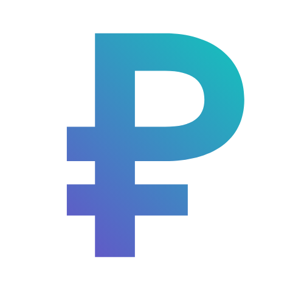

# Pense



A Mutiplatform app to keep troack of your expenses.

## Screenshots
<div>


</div>


## Features

- Store your income and expenses each month
- Various graph to help you visualise date 
- Various statistics for your expenses
- Report of you activity over a given period
- Material You for android
- Custom colors and theme

## Platforms 

Pense is a Flutter application, this means it's support a great variety of platforms by default. 

Because Pense is an offline application that need to store data on the device, there is no web version.

Pense can be compiled to the following platforms :

- Android
- Windows 
- Linux
- IOS *
- MacOs *

\* Compiling the app to both IOS an MacOS requires a device running MacOs. Unfortunaly, i do no have the required hardware to build those app. I you have a Mac and want to build the project, you can compile it by [installing flutter and following the instructions](https://docs.flutter.dev/get-started). The project should work on thoses platforms but again i have no way to test it.

## Installing the app on your system

If you're on Windows, Linux or Android, you can directly grab the application for your
system [on the release page](https://github.com/sylanecpn/pense/releases/latest). On Android you'll just need to put the .apk on your device and click on it to install the software.

For Desktop (Linux & Windows), you have to download the coresponding zipped file and extract it somewhere on your PC. At this point you'll just have to launch the app by double-clicking the executable file ('pense.exe' on Windows or 'pense' on Linux).

* Note that there is no bundle for Windows arm64 target, as i'm writting this, there is not a flutter Windows arm64 sdk for the version i used for the app. 
But apparently, [Windows on ARM can run x64 app with emulation](https://learn.microsoft.com/en-us/windows/arm/apps-on-arm-x86-emulation). So you'll shoud be able to run the app anyway with the x64 version.


If you want to install the app on IOS or MacOs, you'll have to compile it yourself as i don't have an Apple machine to build it myself. I'm sorry :( .


## Getting Started

If you want to run the project from the source code, you will need to install the flutter sdk.

Once it's correctly installed you can run it on your system by entering :

```console
flutter run
```
in your terminal.

You can also build an apk (for android) with :

```console
flutter build apk
```

## Languages

For now, Pense is only available in **French** (My native tongue). Supporting other langauges need dome refactoring, but it might come in the future. Do not hesitate to contact me if you are interested to have the app in another language. You can also create a branch and add it yourself.

## Other 

This a app is a small project i made to help me be more responsible with money. It is not made to be an hobby an not a professional project.

I share it here as it might interest someone. Feel free to fork it or do whatever you want with it.

If you want more more fetures, don't hesitate to open an issue, i'll work on it if it makes sense :)
